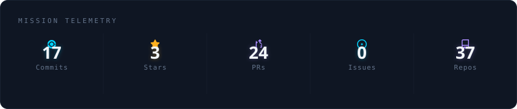

  

 

  

 

  

 

  

 

<strong>More about me</strong>

 

Hi! I'm Henrique, a Front-end Developer with 6+ years of experience building high-performance web applications.
Main stack: React, TypeScript, Next.js
Focused on scalable architectures, real-time systems, and complex interfaces.
Strong background in performance optimization, reusable components, and clean code.
Experience with WebSockets, Hookstate, React Hook Form + Zod, MUI, CI/CD, Docker and Kubernetes.
Currently studying Systems Analysis and Development (graduation in 2025).
Based in Brazil | Open to remote opportunities.

**Currently at** BX@ -- Salvador, BA, Brazil

 

  
  

